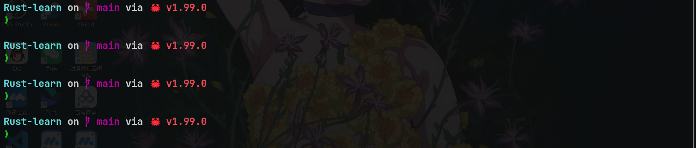
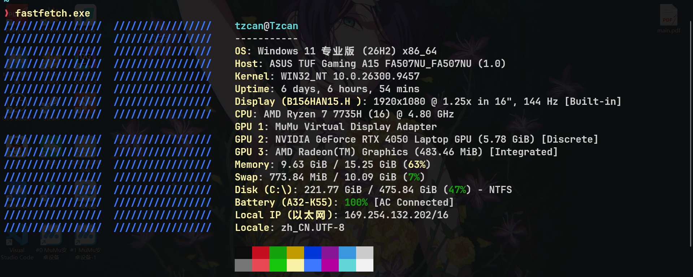

# 终端美化

## 终端显示字体 {#font}
- 推荐安装`JetbrainsMono NerdFont`字体，用于终端以及代码编辑器，[一键直达下载官网](https://www.nerdfonts.com/font-downloads)。
- Windows平台：解压并全选所有字体，右键点击进行安装即可。
- Linux平台：解压并全选所有字体移动到目录`~/.local/share/fonts/`，再执行`fc-cache -fv`刷新字体缓存即可。

## 命令提示符 {#cmd}
- 这里推荐使用[starship](https://starship.rs/zh-CN/)，我个人觉得比较好用,样式也比较好看。效果如图：

- `Windows`，`Linux`，`MacOS`平台都支持，安装方式详见[starship官网](https://starship.rs/zh-CN)。
- 如果你是一名Rust开发者，可直接通过以下命令从源码安装`starship`：
~~~bash
cargo install starship --locked
~~~

> [!IMPORTANT]
> 为了使终端能够正常显示图标而不出现乱码，请先安装[NerdFont字体](./#font)。

### starship配置
- Windows配置文件路径：`C:\Users\<username>\.config\starship.toml`
- Linux配置文件路径：`/home/<username>/.config/starship.toml`

> [!TIP]
> 如何不存在上述目录以及文件，请手动创建。

- 这里贴一个我的配置：
~~~toml
# 根据 schema 提供自动补全
"$schema" = 'https://starship.rs/config-schema.json'

# 在提示符之间插入空行
add_newline = true
command_timeout = 500

# 提示符样式：['❯','➜']
[character]
success_symbol = '[❯](bold green)'
error_symbol = '[❯](bold red)'

# 目录显示设置
[directory]
truncation_length = 4
truncate_to_repo = true

# 禁用 'package' 组件，将其隐藏
[package]
disabled = true

# 命令耗时
[cmd_duration]
min_time = 2000
format = '⏳ [$duration]($style)'
~~~

## 一键概览系统信息 {#fastfetch}
- 使用`fastfetch`一键获取系统信息，效果如图：[一键直达`fastfetch`官网](https://fastfetch.dev/)

### 快速安装
- Windows
~~~powershell
winget install fastfetch # Windows 10/11
~~~

- Fedora Linux
~~~bash
sudo dnf install fastfetch
~~~

- Arch Linux
~~~bash 
sudo pacman -S fastfetch
~~~

- MacOS & LinuxBrew
~~~bash
brew install fastfetch
~~~

> [!TIP]
> 如果你使用其他Linux发行版，可以前往[官方GitHub-Release页面](https://github.com/fastfetch-cli/fastfetch/releases)页面进行下载。